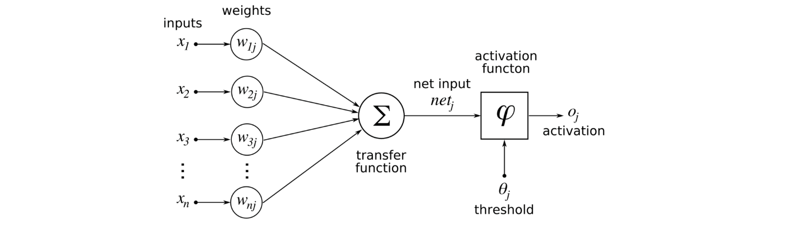

As we've learned in Chapter2, in theory, we can implement complicated logics with perceptron.
However, it still requires human to do the calculations to select proper values for weights.  
Neural Network can solve this problem.

## Perceptron to Neural Network
A neural network is a network or circuit of neurons, or in a modern sense, an artificial neural network, composed of artificial neurons or node.  

Let's review perceptron first.  
y = 0(b+w1x1 + w2x2 <=0) where b is bias  
y = 1(b+w1x1 + w2x2 > 0) where b is bias   
  
Making the eqautions simpler,  
y = h(b + w1x1 + w2x2)  
h(x) = 0 (x <= 0)  
h(x) = 1 (x >  0)  
h(x) is called Activation Fucntion.  

## Activation function
An activation function in a neural network defines how the weighted sum of the input is transformed into an output from a node or nodes in a layer of the network.    

In equation,  
a = b+ w1x1 + w2x2  
y = h(a)  
  
### Sigmoid function
A sigmoid function is a bounded, differentiable, real function that is defined for all real input values and has a non-negative derivative at each point
and exactly one inflection point. A sigmoid "function" and a sigmoid "curve" refer to the same object.
h(x) = 1/(1+exp(-x))  

### Drawing Sigmoid Function on Python

### Step function

